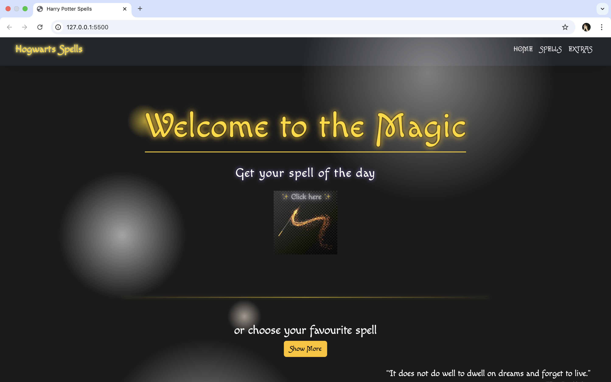
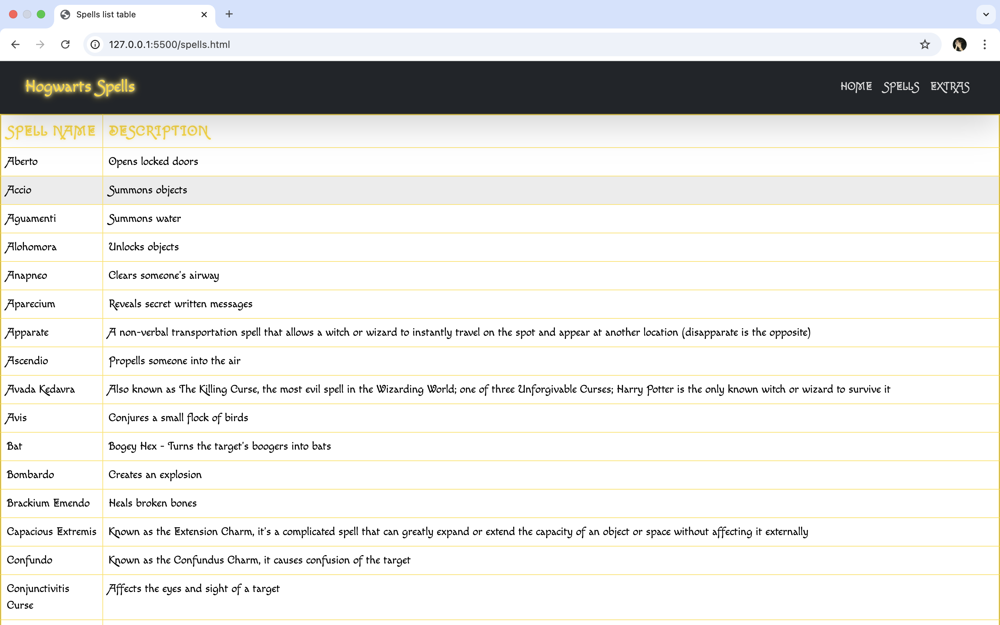
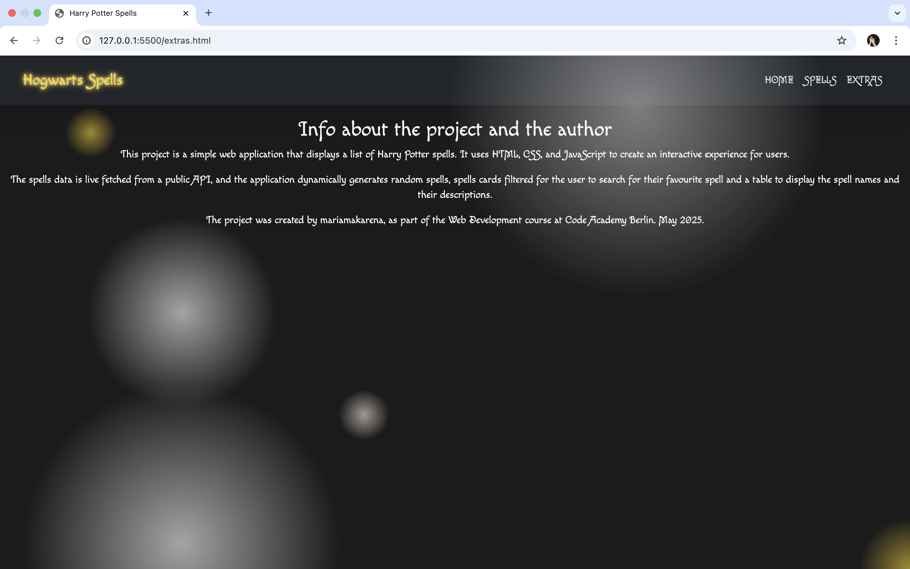

# Hogwarts Spells – Spellbook Web App

This is a simple web app to explore and search through spells from the Harry Potter universe. It was developed using HTML, CSS, JavaScript, and Bootstrap during the Web Development course at CodeAcademy Berlin in May 2025.

## Features

- Random spell generator
- Searchable spell list with names and descriptions
- About page with project context
- Responsive layout with basic animations and styling

## Screenshots

Home  


Spell List  


About  


## Technologies

- HTML  
- CSS  
- JavaScript  
- Bootstrap  
- Public spell API


## API

The app fetches data from a public API. Each spell object contains:

```json
{
  "id": "a1b2c3",
  "name": "Alohomora",
  "description": "Opens locked objects."
}
```

## Author

Created by @mariamakarena as part of the CodeAcademy Berlin course, May 2025.

## License

This project is for educational purposes only. All Harry Potter content belongs to J.K. Rowling and Warner Bros.

